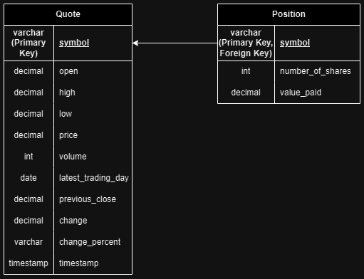

# Introduction
The Stock Quote App is a command-line application designed to simulate the management of a stock portfolio. Users can retrieve current stock information through the Alpha Vantage API and store this data in a PostgreSQL database using JDBC. They can then simulate buying/selling stocks and view currently held positions. The app utilizes Maven for dependency management, Docker for containerization, Jackson for parsing and serializing between JSON and Java objects, JUnit and Mockito for testing, as well as SLF4J and LOG4J for logging.

# Implementation
## ER Diagram

## Design Patterns
The application employs the Data Access Object (DAO) and Repository design patterns to streamline data management and enhance code maintainability. The DAO pattern encapsulates all interactions with the database within dedicated DAO classes (`QuoteDao` and `PositionDao`). This isolates the database access logic from the business logic, while making the codebase easier to manage. By centralizing data operations, testing is made easier and any potential future migrations to different data sources can be done without significant changes to the business layer.

The Repository design pattern is also used to add another abstraction layer that decouples data access from business logic. Both `QuoteService` and `PositionService` implement the repository pattern to interact with `QuoteDao` and `PositionDao` to perform operations on business domain objects, enabling the application to work with these objects directly instead of using manual database interactions. This approach simplifies data source interactions and enhances code readability.

# Test
The Stock Quote App was tested using JUnit for unit tests and Mockito for mocking dependencies. A separate PostgreSQL database named "host_agent_test" is used to ensure that tests do not modify production data. Before each test, the database is cleaned to provide a consistent testing environment, and transactions are rolled back after each test to maintain data integrity. Mockito is used to mock dependencies, in this case the Alpha Vantage API. Integration tests were added to check end to end functionality.