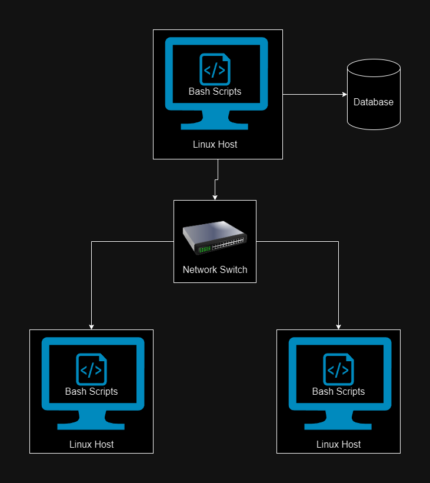

# Linux Cluster Monitoring Agent


# Introduction

The Linux Cluster Monitoring Agent is designed to gather and monitor hardware specifications and real-time resource usage of a Linux cluster. By using Bash scripts for data collection, PostgreSQL for data storage, Docker for containerizing the PostgreSQL instance, Git for version control, and Cron for task scheduling, this tool provides an efficient way to track system performance metrics. System administrators can use the tool to monitor system health and optimize resource allocation accordingly to help make decisions regarding future resource planning for a Linux environment.

The project uses two main Bash scripts: `host_info.sh` for collecting hardware specifications (CPU speed, total available memory, etc.), and `host_usage.sh` for collecting real-time resource usage data (CPU idle time, amount of free memory, etc). Users can utilize SQL queries to obtain specific data that pertains to their business decisions regarding resource management.

Technologies used in this project include Bash scripting, Docker, PostgreSQL, Git, and Cron.


# Quick Start
### Start a psql instance using psql_docker.sh
```./scripts/psql_docker.sh start [db_username][db_password]```
### Create tables using ddl.sql
```psql -h localhost -U postgres -d host_agent -f sql/ddl.sql```
### Insert hardware specs data into the DB using host_info.sh
```./scripts/host_info.sh [psql_host] [psql_port] [db_name] [psql_user] [psql_password]```
### Insert hardware usage data into the DB using host_usage.sh
```bash scripts/host_usage.sh [psql_host] [psql_port] [db_name] [psql_user] [psql_password]```
### Crontab setup
```
# Edit crontab jobs by entering the following command in your terminal:
bash> crontab -e

# Then add the following to crontab:
* * * * * bash [path-to-host_usage.sh] localhost 5432 host_agent postgres password > /tmp/host_usage.log
```

# Implementation
This project was built using the full software development life cycle (SDLC) to plan, design, implement, test, and deploy the Linux Monitoring Agent. During the **planning** stage, the objectives of the project were defined based on requirements of the users. Requirements were allocated resources and tasks were scheduled accordingly to be completed within the next sprint. In the **design** stage, I analyzed the requirements and selected the technologies that would be used for the project. Specifically, Bash scripts would be used for data collection, PostgreSQL for data storage, Docker for containerizing the PostgreSQL instance, Git for version control, and Cron for task scheduling.

Once the tasks were sorted out and the technologies were selected, I started the **implementation** stage by setting up version control using Git and provisioning the PostgreSQL instance using Docker. I then setup the `ddl.sql` file to automatically create the two tables (`host_info` and `host_usage`)  in the `host_agent` PostgreSQL database. The next step was to create the Bash scripts to collect hardware specification and real-time resource usage data. `host_info.sh` collects data on hardware specification such as the number of CPUs, CPU speed, and the timestamp at which the data was collected. This script is run once to gather the necessary hardware information for the system. `host_usage.sh` collects data on real-time resource usage such as the total memory, available disk space, and the CPU idle time percentage. I used Cron to automatically run this `host_usage.sh` script once every 60 seconds and update the `host_agent` database accordingly.

Once the implementation of the project was finished, I moved on to the **testing** stage, where I checked to see if the database was being updated correctly every 60 seconds with real-time resource usage data, and to ensure that there were no issues with insertions into the database. In the final **deployment** stage, after confirming that the project was ready for production, I deployed the project using Docker and Crontab.

# Architecture


# Scripts
## psql_docker.sh
This script is used to create, start, or stop a PostgreSQL instance inside a Docker container.

Usage:

```./scripts/psql_docker.sh start [db_username][db_password]```


## host_info.sh
This script is used to collect hardware specifications of the host machine and inserts the data into the `host_info` table in the PostgreSQL database.

Usage:

```./scripts/host_info.sh [psql_host] [psql_port] [db_name] [psql_user] [psql_password]```


## host_usage.sh
This script collects real-time resource usage data and inserts the data into the `host_usage` table in the PostgreSQL database.

Usage:

```bash scripts/host_usage.sh [psql_host] [psql_port] [db_name] [psql_user] [psql_password]```

## crontab
A cron job is set up to run the `host_usage.sh` script every 60 seconds, in order to automate the real-time data collection.

Usage:

```
# Edit crontab jobs by entering the following command in your terminal:
bash> crontab -e

# Then add the following to crontab:
* * * * * bash [path-to-host_usage.sh] localhost 5432 host_agent postgres password > /tmp/host_usage.log
```


# Database Modeling
The `host_data` database consists of two tables: `host_info` to store hardware specification data, and `host_usage` to store real-time resource usage data. Here are the schema for each of the two tables:
### `host_info`
| Column            | Data Type | Description                             |
|-------------------|-----------|-----------------------------------------|
| id                | SERIAL    | Primary key                             |
| hostname          | VARCHAR   | Hostname of the machine                 |
| cpu_number        | INTEGER   | Number of CPU cores                     |
| cpu_architecture  | VARCHAR   | CPU architecture (e.g., x86_64)         |
| cpu_model         | VARCHAR   | Model name of the CPU                   |
| cpu_mhz           | FLOAT     | CPU speed in MHz                        |
| l2_cache          | INTEGER   | L2 cache size in KB                     |
| total_mem         | INTEGER   | Total memory in MB                      |
| timestamp         | TIMESTAMP | Timestamp when data was collected            |


### `host_usage`

| Column         | Data Type | Description                      |
|----------------|-----------|----------------------------------|
| id             | SERIAL    | Primary key                      |
| hostname       | VARCHAR   | Hostname of the machine          |
| memory_free    | INTEGER   | Free memory in MB                |
| cpu_idle       | FLOAT     | CPU idle percentage              |
| cpu_kernel     | FLOAT     | CPU kernel percentage            |
| disk_io        | INTEGER   | Number of disk I/O operations    |
| disk_available | INTEGER   | Available disk space in MB       |
| timestamp      | TIMESTAMP | Timestamp when data was collected     |

# Test
Each of the scripts were tested before deployment to ensure that the right data was gathered using the Bash scripts, and then inserted correctly into the `host_agent` database without any issues. I verified that the scripts were being executed every 60 seconds using crontab and updated accordingly in the database.


# Deployment
The project was deployed using Docker and crontab. Docker was used to containerize the postgreSQL database, ensuring an isolated environment across different systems. The `psql_docker.sh` script was used to manage the lifecycle of the container. Crontab was then used to automate the real-time data collection using the `host_usage.sh` script. The script was scheduled to run every 60 seconds.

# Improvements
### 1. Create an online dashboard 
A dashboard could be added to make it easier for users to monitor their linux cluster information in real-time. The dashboard could display information from the database in an intuitive table layout with options to sort by column. Users could also have an option to generate certain charts based on information in the dashboard and either display these charts in the browser or download them.

### 2. Improve database reliability 
To ensure reliability when scaling the application to work with larger Linux clusters, database replication could be implemented with multiple replicas of the main database maintained across different nodes. This way, a single database failing wouldn’t result in any data loss or downtime.

### 3. Improve database performance 
When scaling the application to work with larger Linux clusters, performance might slow down. Performance could be improved to maintain fast read/write speeds by implementing database sharding. By partitioning the data cross multiple PostgreSQL instances, queries wouldn’t be throttled as easily when multiple requests are being made at once for different data stored in the database. Overall, this would help with horizontal scaling as more nodes are added to the cluster and allow the system to handle a higher volume of data and requests for a larger amount of servers without slowing down service.


