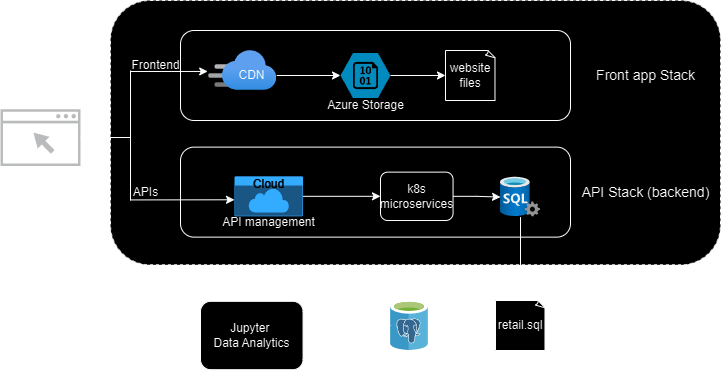

# Introduction
This project is designed as a proof of concept for improving sales and marketing strategies for the London Gift Shop (LGS), a UK based online retailer specializing in selling gift-ware. By analyzing historical transaction data between 01/12/2009 and 09/12/2011, we can gain a better understanding of customer purchase patterns through metrics such as monthly sales, customer activity, and RFM (Recency, Frequency, Monetary) analysis, which will help LGS develop targeted marketing campaigns in order to increase customer engagement and improve revenue growth. The project was built using Jupyter Notebook with Python, PostgreSQL for data storage, and various python libraries such as Pandas for data cleaning and manipulation, Numpy for numerical operations, and Matplotlib for generating graphs.

# Implementaion
## Project Architecture
The LGS web app consists of a Frontend stack where resources are served through a CDN and stored in Azure Blob storage. API requests from the frontend are routed to the backend, which is deployed using AKS (Azure Kuberneties Service) to handle different parts of the application logic. These microservices interact with the SQL server where transaction data is stored. Transaction data is pulled from this server and stored in a PostgreSQL database, where the data is then analyzed in a Jupyter Notebook. 

## Data Analytics and Wrangling

Through the analysis of transaction data from LGS, various insights were gained regarding total invoice amount distribution, monthly sales, growth over time, active user statistics as well as user classification using RFM segmentation. LGS can utilize these insights to do the following:

- Identify customer segments based on prior purchasing behavior
- Create customized marketing campaigns to better target existing customers
- Optimize promotional strategies based on sales trends and customer engagement patterns

These strategies will allow LGS to better target their marketing in order to improve their revenue growth while increasing customer engagement.

# Improvements
1. Create interactive dashboard frontend to allow non technical team members to easily explore data and insights dynamically.
2. Create more detailed customer segmentation metrics to enable even more personlized marketing
3. Implement automated reporting that summarizes key metrics such as dips or spikes in new customers each week
